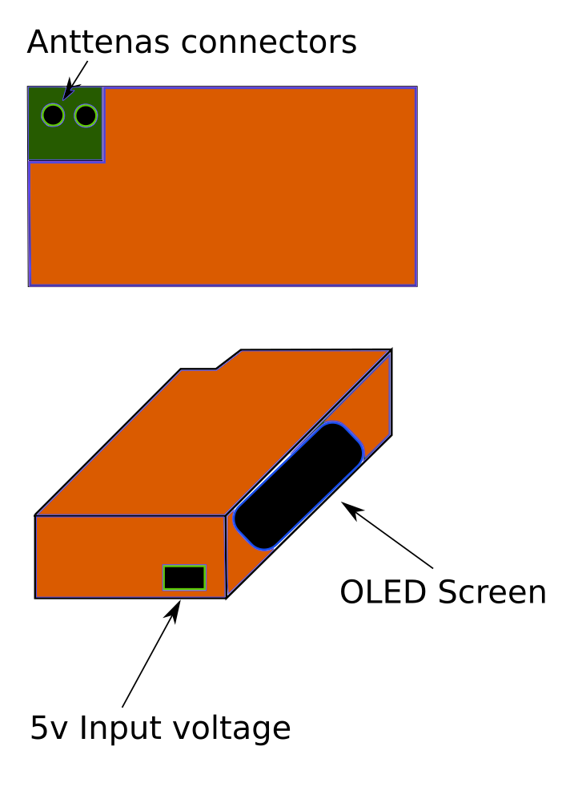

# Car-Data-Collector

## Relevant data to collect

* Max speed
* Distance traveled
* Altitude
* Orentation
* Acelaration
* Detection of sudden movements
* Inclination
* Global position

## The hardware for this device will be the next:

- Gps module (NEO-6M)

- Module gsm to send data to some kind of server (SIM800L) **Note: only 2G support** 

- Acelerometer and Gyroscope module (MPU650)

- A little OLED screen 

- Some SBC with the next peripherials:
	- UART
	- I2C

## Conceptual design

